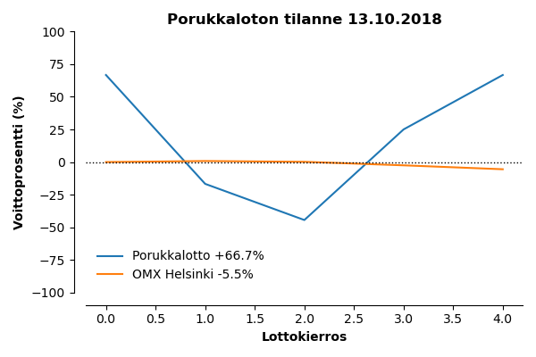

# kimppalotto
on yksinkertainen Python-skripti kimppaloton tulostenseurantaan. Skriptille annetaan pelattujen lottokierrosten voittotiedot Excel-tiedostona, jonka jälkeen skripti visualisoi kimppaloton voittoprosentin pelattujen kierrosten funktiona. Lisäksi skripti piirtää samaan kuvaajaan Helsingin pörssin OMXH25 -osakeindeksin kehityksen kertomaan, kuinka paljon lottoon käytetty raha olisi voinut tuottaa sijoitettuna.

### Syöte
Syötteenä toimivan Excel-tiedoston rakenteen tulee olla seuraavanlainen:

| date  | game | price | win |
| ------------- | ------------- | ------------- | ------------- |
| 15.9.2018  | lotto  | 3  | 5  |
| 22.9.2018  | lotto  | 3  | 0  |
| 29.9.2018  | lotto  | 3  | 0  |
| 6.10.2018  | lotto  | 3  | 10  |
| 13.10.2018  | lotto  | 3  | 10  |

Sarakkeet `date`, `price` ja `win` ovat pakollisia. Näiden sarakkeiden tulee sisältää tiedot lottokierroksen päivämäärästä, hinnasta sekä kierroksella saaduista voitoista.

### Skriptin ajaminen

Sijoita tiedosto kansioon `data/data.xlsx` ja aja skripti juurikansiosta komennolla `python kimppalotto.py`. Voit mukauttaa skriptin toimintaa sen hyväksymien komentojen avulla; lisätietoja skriptin hyväksymistä komennoista saat `-h` komennon avulla.

```
> python kimppalotto.py -h
usage: kimppalotto.py [-h] [-dpi DPI] [-o OUTPUT]

optional arguments:
   -h, --help   show this help message and exit
   -dpi DPI     Image DPI, default 300 DPI
   -i INPUT     Name of input Excel file, default 'data/data.xlsx'
   -o OUTPUT    Name of output image file, default 'kimppalotto.png'
```

### Skriptin tuloste

Yllä mainittu esimerkkisyöte löytyy kansiosta `example/example.xlsx`, jonka avulla voimme testata skriptin toimintaa. 

```
> python kimppalotto.py -i example/example.xlsx -o example/example.png
```


